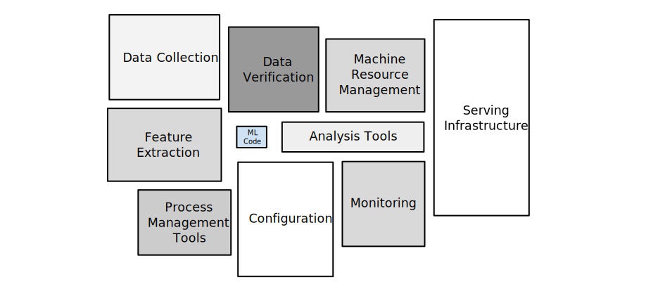
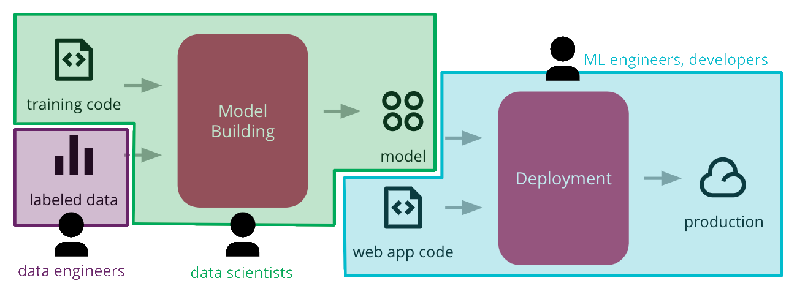
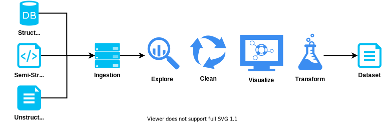
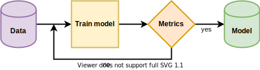
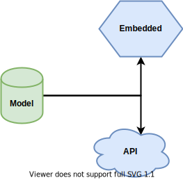
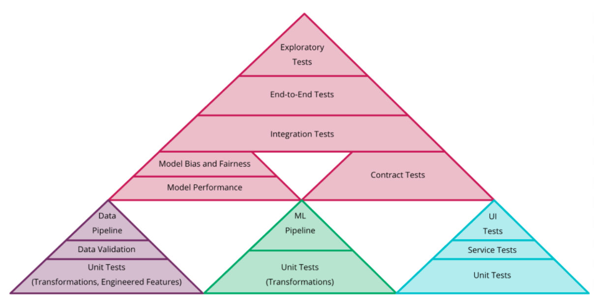
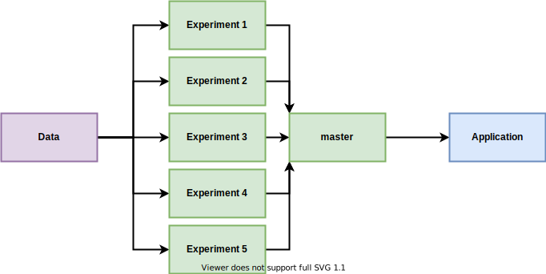
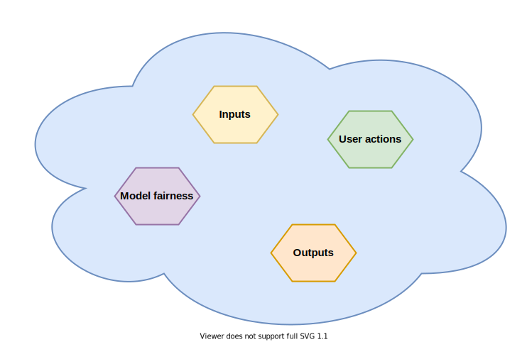

# Machine Learning workflow
<!--
    L'obiettivo di questa presentazione è quello di sollevare la seguente domanda: "il workflow di un progetto di machine learning cambia rispetto a quello dello sviluppo software tradizionale? e se si, come?"
-->

---

# 5%
Estimate size of the machine learning component with respect to the overall ecosystem

---

# What else?

---

<!--
    Una parte di questi blocchi viene gestita da altri sistemi (ad esempio un cloud provider può occuparsi di architettura e gestione delle macchine
-->

---

## More Pipelines

---

---

<!--
    Ognuno di questi strati si occupa di produrre un artefatto che viene utilizzato dallo strato successivo.
    Si tratta di 3 pipeline distinte, ognuna lavorata da un team con competenze diverse, con architetture, linguaggi e tipi di artefatti diversi.
    Vengono gestiti come 3 sistemi diversi in integrazione tra loro.
-->

---

## Data Pipeline

---

<!--
    Structured: relational db; semi-structured: XML; unstructured: images
    Questi dati devono essere raccolti e persistiti in qualche modo. Viene poi fatta una analisi esplorativa per iniziare a comprendere se e che tipo di informazioni utili contengono, si fa pulizia di dati corrotti o mancanti, si trasformano delle features per averle nei formati più corretti per i bisogni della prossima pipeline, se necessario si creano o rimuovono features, si visualizzano i dati tramite dei grafici per comprenderli meglio.
    L’artefatto prodotto viene poi versionato (!) e reso disponibile al prossimo layer.
-->

---

## Model Pipeline

---

---

## Serving

---

---

## Testing

---

<!--
    Validazione dati: formato, range, one-hot encoded solo 0 o 1, engineered features calcolate correttamente, valori mancanti rimpiazzati correttamente.
    Contract testing tra l’applicazione e l’API esposta.
    Metriche per valutare le performance del modello, soglie sotto cui bloccare la pipeline.
-->

---

## Experiments

---

<!-- 
    Ogni esperimento gira su un suo branch, utilizza lo stesso dataset (eventualmente fa delle trasformazioni particolari) e ha una sua pipeline (con le sue metriche di valutazione).
    Quello che viene preferito viene mergiato sul master e gli altri possono essere eliminati 
-->

---

## Monitoring

---

<!--
    * Inputs: che tipo di dati sono stati dati in pasto al modello, se ci sono delle distorsioni rispetto al training.
    * Outputs: che previsioni vengono fatte dal modello, per capire se si sta comportando come atteso.
    * User actions: cosa l'utente se ne fa delle previsioni, se e come cambia il suo comportamento, se otteniamo quello per cui il modello è stato prodotto.
    * Model fairness: analizzare le previsioni di feature note che possono contenere bias
-->

---

# Thanks