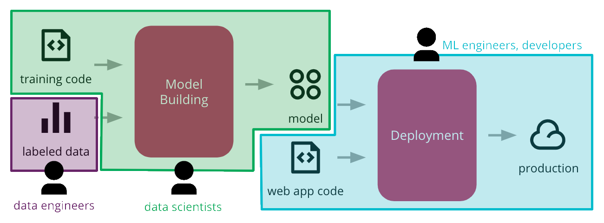
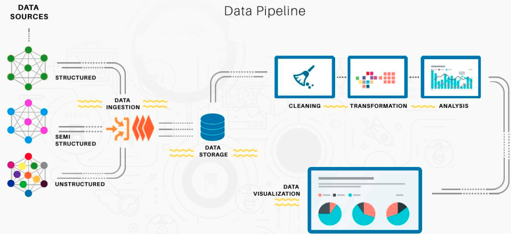
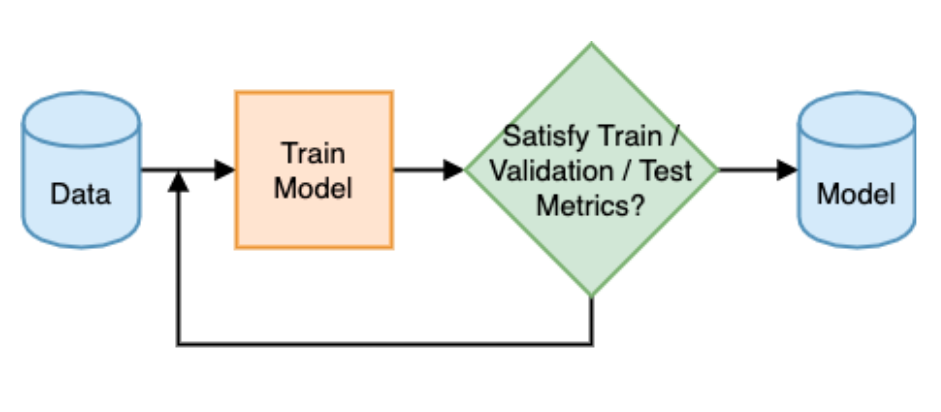
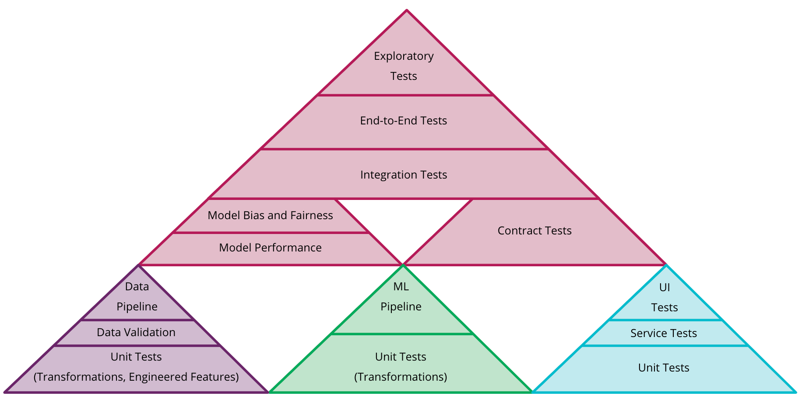

# Machine Learning workflow

---

# 5%
Estimate size of the machine learning component with respect to the overall ecosystem

---

# What else?

---

---

---

---

---

---

# API | Embed

---

