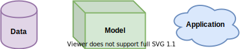
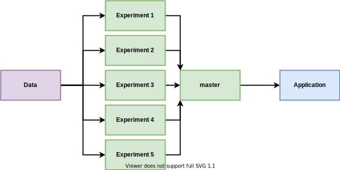

# Machine Learning workflow

---

# 5%
Estimate size of the machine learning component with respect to the overall ecosystem

---

# What else?

---

<!-- Una parte di questi blocchi viene gestita da altri sistemi (ad esempio un cloud provider può occuparsi di architettura e gestione delle macchine) -->

---

---

<!-- Ognuno di questi strati si occupa di produrre un artefatto che viene utilizzato dallo strato successivo.
Si tratta di 3 pipeline distinte, ognuna lavorata da un team con competenze diverse, con architetture, linguaggi e tipi di artefatti diversi.
Vengono gestiti come 3 sistemi diversi in integrazione tra loro. -->

---

<!-- Structured: relational db; semi-structured: XML; unstructured: images
Questi dati devono essere raccolti e persistiti in qualche modo. Viene poi fatta una analisi esplorativa per iniziare a comprendere se e che tipo di informazioni utili contengono, si fa pulizia di dati corrotti o mancanti, si trasformano delle features per averle nei formati più corretti per i bisogni della prossima pipeline, se necessario si creano o rimuovono features, si visualizzano i dati tramite dei grafici per comprenderli meglio.
L’artefatto prodotto viene poi versionato (!) e reso disponibile al prossimo layer. -->

---

---

# API | Embed

---

<!-- Validazione dati: formato, range, one-hot encoded solo 0 o 1, engineered features calcolate correttamente, valori mancanti rimpiazzati correttamente.
Contract testing tra l’applicazione e l’API esposta.
Metriche per valutare le performance del modello, soglie sotto cui bloccare la pipeline. -->

---

<!-- 
    Ogni esperimento gira su un suo branch, utilizza lo stesso dataset (eventualmente fa delle trasformazioni particolari) e ha una sua pipeline (con le sue metriche di valutazione).
    Quello che viene preferito viene mergiato sul master e gli altri possono essere eliminati 
-->